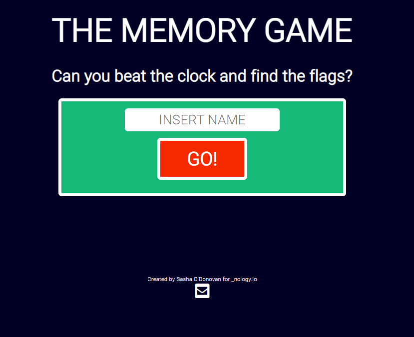
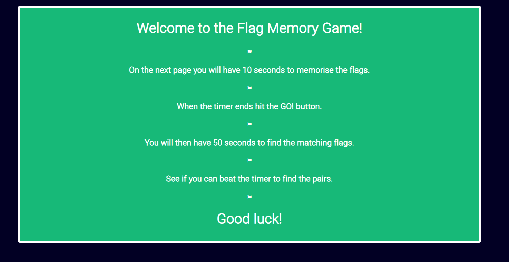
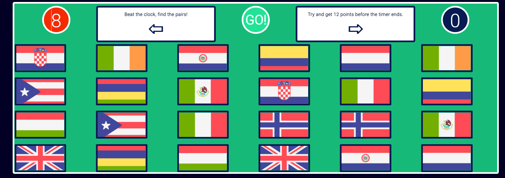
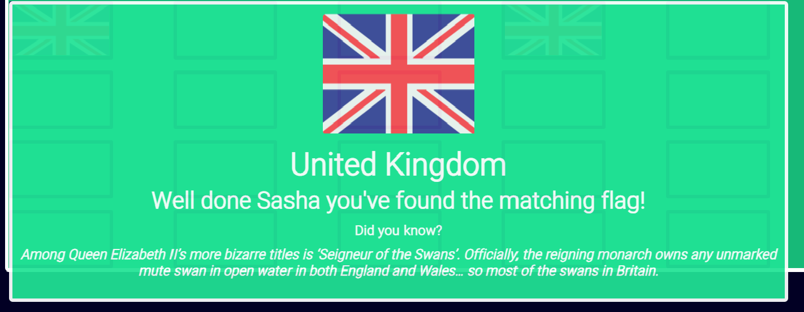

# nology_javascript_game

Skills

<ul>
<li>HTML</li>
<li>CSS</li>
<li>SASS</li>
<li>BEM</li>
<li>Figma</li>
<li>Git & GitHub</li>
</ul>

JavaScript

<ul>
<li>Array of Objects</li>
<li>Dynamic Html created by JavaScript</li>
<li>forEach()</li>
<li>setTimer()</li>
<li>setInterval()</li>
<li>Event Listeners</li>
<li>Pushing to arrays</li>
</ul>

Game Logic & Explanataion

We were tasked with creating our first vanilla JS game, I wanted to create a memory game using flags.

I intially designed the layout of the game on Figma **https://www.figma.com/file/K1zKeJSRECYxoke32vx50T/Untitled?node-id=0%3A1**

The idea being that the player would need to memorise where the flags are on the screen and then have a set amount of time to find them.

Using click events on the intial pages, I was able to create a starter page and an instructions page.
Intially the user inserts their name which is used in pop ups at certain milestones in the game. 
If the user does not insert a name, it will display an alert. 

It then displays instructions to the game.

Once the player inserts their name and clicks the button, the flags are displayed using dynamic JavaScript and then hidden after a set time.

The player is then tasked with finding the flags and on each click, this info is pushed to array which targets a data file. This data file is array of objects with a country, flag image and fact.

This information is then used to display a message when the play finds a match, displaying the country/flag and an interesting (?!) fact including their name too for added personalisation.

Once the player finds all the pairs, it displays a personalised winning message.
If they do not find all the pairs before 0 seconds, it displays a game over message with a restart button.
All game messages were created using dynamic JavaScript pulling down data from a data file of Country data.

Several timers were used and functions to display styling to show and hide the flags at the appropriate times.
